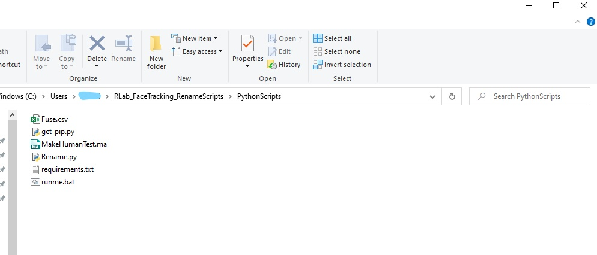

# RLab_RenameScripts

Todd Bryant, Kat Sullivan and Grant Ng

# Installing Python

If you don't have Python 3, download Python [here](https://www.python.org/downloads/). **Make sure you check off "Python version number to PATH"!** Also be sure to include pip in the installation. (If you don't, details on how to do that are below)


# Installing pip

If you already have pip installed, please skip this section.

In terminal, cd to where you installed this repository, then cd to the PythonScripts folder.
To install pip, simply run:

```
python get-pip.py
```

# How to Run Our Script

The script will take care of any additional python libraries and run the Python renaming script. It will search for a csv file in the PythonScript file so **be sure you choose either the Fuse.csv or Makehuman.csv file (found in the csv_files folder) and move it inside the PythonScripts folder**. You will also place your Maya file (.ma) into the PythonScripts folder. The script will rewrite the .ma file with the correct naming syntax in order to have the blendshapes register in Unreal. The blendshapes needs to be named in a specific way for Apple’s ARKit to work on the new model. 

The file structure should look this 


Once that is done, be sure to be running command prompt as admin and from the PythonScripts folder run

```
runme.bat
```


If you have any pip-related issues try upgrading pip by

```
py -m pip install --upgrade pip
```

**For MAC Users:** 

- open terminal, search for” terminal” in the finder. 
- Navigate to the folder where the python scripts live (cd into the folder). 
  Open the terminal and type in: 

```
	source runme.sh
```

Once the program runs make sure to type in: 

```
deactivate
```

